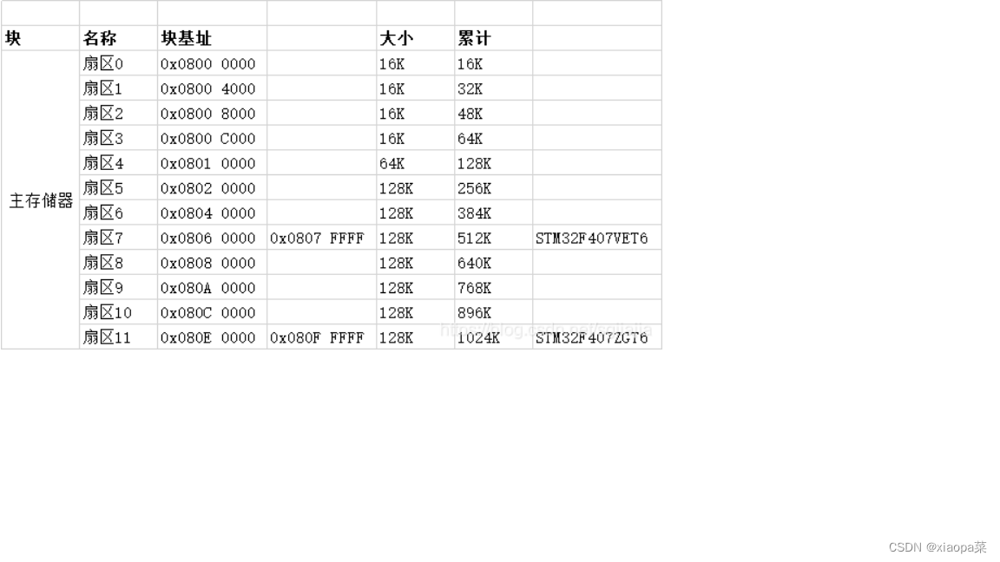
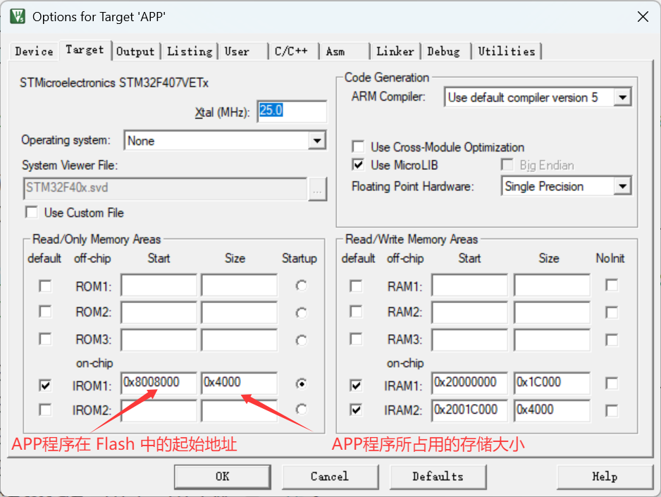
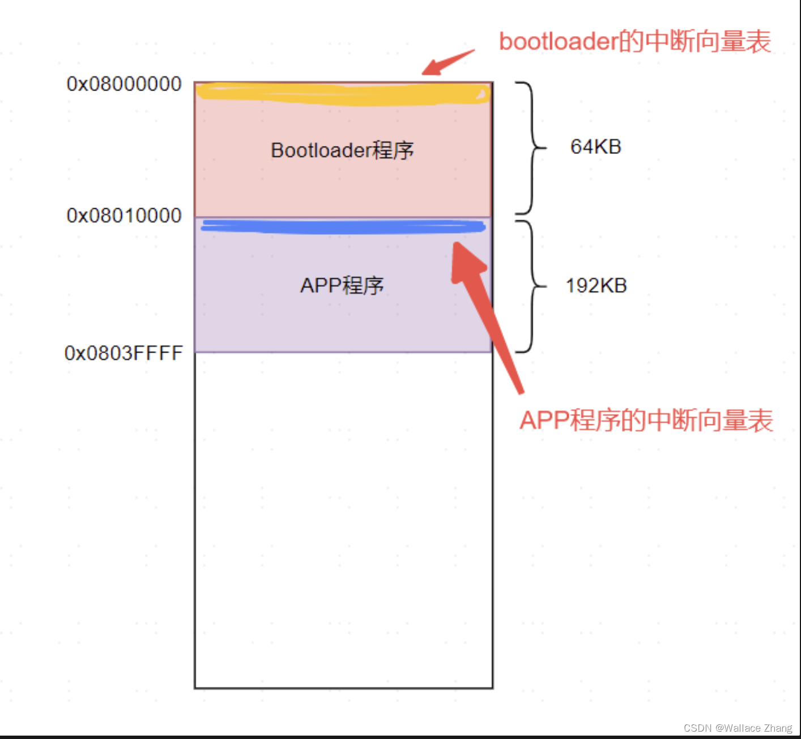
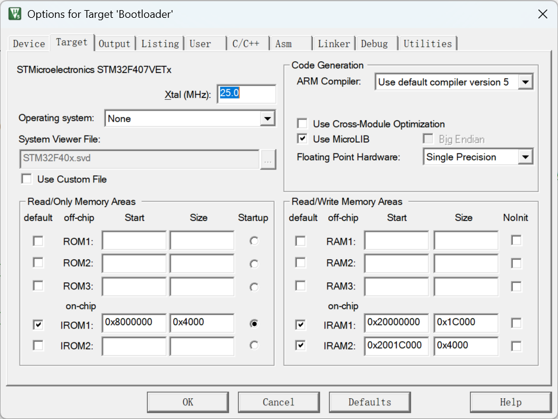
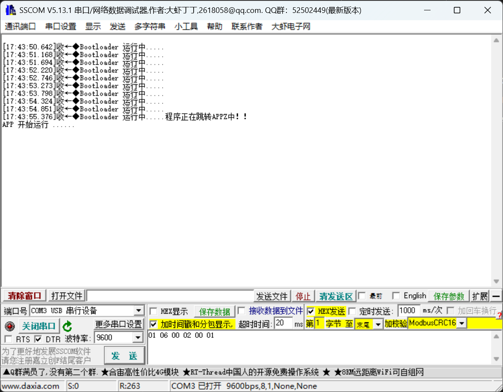

# Bootloader 笔记

实现一个简单的从 bootloader 跳转进入 app 程序的 demo

### 大体流程

首先需要准备两个程序，一个是 app 程序，另一个就是 bootloader 程序，然后分别更改放入 Flash 的首地址，bootloader在前，qpp在后，然后分别烧录到 Flash 当中。

#### Flash 的分配，参照mcu的flash分配空间



### 实战

#### APP 程序

```c
int main(void)
{
  /* USER CODE BEGIN 1 */
	SCB->VTOR = 0x08008000;
  /* USER CODE END 1 */

  /* MCU Configuration--------------------------------------------------------*/

  /* Reset of all peripherals, Initializes the Flash interface and the Systick. */
  HAL_Init();

  /* USER CODE BEGIN Init */

  /* USER CODE END Init */

  /* Configure the system clock */
  SystemClock_Config();

  /* USER CODE BEGIN SysInit */

  /* USER CODE END SysInit */

  /* Initialize all configured peripherals */
  MX_GPIO_Init();
  MX_USART1_UART_Init();
  /* USER CODE BEGIN 2 */
	
	printf("APP 开始运行 ......");
	
  /* USER CODE END 2 */

  /* Infinite loop */
  /* USER CODE BEGIN WHILE */
  while (1)
  {
      
	  key_Task();
	  
    /* USER CODE END WHILE */

    /* USER CODE BEGIN 3 */
  }
  /* USER CODE END 3 */
}

void key_Task()
{
	if(uwTick - key_time < 100)	return;
	key_time = uwTick;
	
	if(0 == HAL_GPIO_ReadPin(GPIOA,GPIO_PIN_1))		// key2 控制 红灯
	  {
//		  while(0 == HAL_GPIO_ReadPin(GPIOA,GPIO_PIN_1));
		  HAL_GPIO_TogglePin(GPIOC,GPIO_PIN_5);
	  } 
	  if(0 == HAL_GPIO_ReadPin(GPIOA,GPIO_PIN_4))		// key3 控制 蓝灯
	  {
//		  while(0 == HAL_GPIO_ReadPin(GPIOA,GPIO_PIN_4));
		  HAL_GPIO_TogglePin(GPIOB,GPIO_PIN_2);
	  }
	
}
```

准备好一套简单的 APP 程序



更改 APP 程序在Flash 中的起始地址

```c
 /* USER CODE BEGIN 1 */
	SCB->VTOR = 0x08008000;
  /* USER CODE END 1 */

  /* MCU Configuration--------------------------------------------------------*/
```

**注意：**这里必须在 APP 程序运行前**手动更新一下 中断向量表的地址**，将此时的中断向量表更改为 APP 的中断向量表所在的位置（也就是当前的 APP程序 所在的首地址），然后在算是真正跳转到 APP 程序执行。



#### Bootloader 程序

Bootloader.c

```c
#include "bootloaer.h"
 
void jump_to_app(uint32_t app_addr)
{ 
    
    pFunction jump_to_application;
    uint32_t jump_address;
    
    /* Check if valid stack address (RAM address) then jump to user application */
    if (((*(__IO uint32_t*)app_addr) & 0x2FFE0000 ) == 0x20000000)
    {
      /* Jump to user application */
      jump_address = *(__IO uint32_t*) (app_addr + 4);
      jump_to_application = (pFunction) jump_address;
      /* Initialize user application's Stack Pointer */
      __set_MSP(*(__IO uint32_t*) jump_address);
      jump_to_application();
    }    
    
}
```

```
作用：把控制权从 Bootloader 切换到用户 App。

核心点：
app_addr[0] → MSP 初值
app_addr[1] → Reset_Handler 地址
__set_MSP() 设置栈顶
跳转到 Reset_Handler 执行 App
```

Bootloader.h

```c
#ifndef __BOOTLOADER_H_
#define __BOOTLOADER_H_
 
#include "main.h"
#include "stm32f4xx.h"
 
typedef  void (*pFunction)(void);
 
/*!
* @brief 跳转到应用程序段
*        执行条件：无
* @param[in1] : 用户代码起始地址.
*
* @retval: 无
*/

#define FLASH_JUMP_ADDR							(0x08008000)		// 对应了 APP 程序的起始地址
 
void jump_to_app(uint32_t app_addr);
#endif
```

main.c

```c
  /* USER CODE BEGIN WHILE */
    while (1)
    {
    /* USER CODE END WHILE */
 
    /* USER CODE BEGIN 3 */
        HAL_GPIO_TogglePin(LED_GPIO_Port, LED_Pin);
        HAL_Delay(500);
				printf("BOOTLOADER灯反转中！！\r\n");
        count++;
 
        if(count == 10)
        {		
            printf("程序正在跳转APPZ中！！\r\n");
            if(((FLASH_JUMP_ADDR+4)&0xFF000000)==0x08000000) //Judge if start at 0X08XXXXXX.
            {
                jump_to_app(FLASH_JUMP_ADDR); // Jump to  APP
            }
        }
    }
```

```
上电后先跑 Bootloader
LED 闪烁，打印调试信息（提示 Bootloader 在运行）
当 count==10 时，调用 jump_to_app()
控制权切换到 APP 程序
```



### 烧录程序

首先全编译两个程序，然后 **先烧录 **Bootloader 程序，再烧录 APP 程序



### 扩充：

在 Bootloader 程序中，可以调用串口程序和某些协议对 **指定位置的Flash** 进行修改，从而达到**远程 OTA** 的目的。


